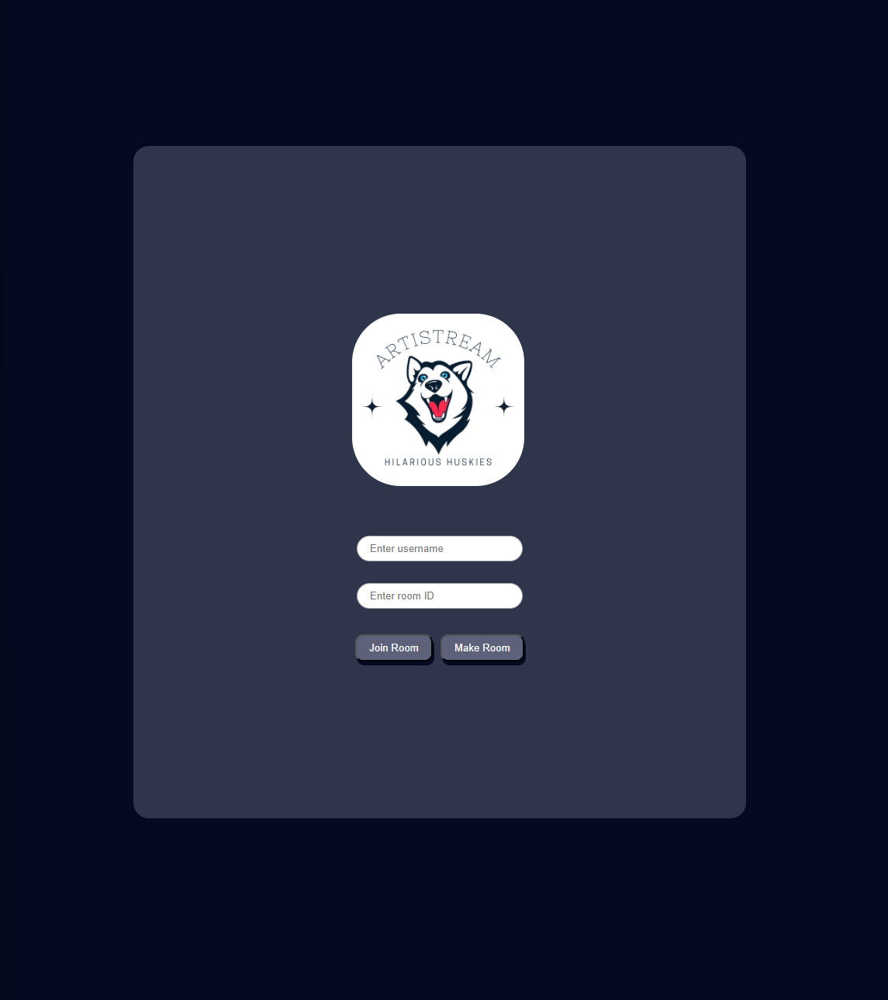
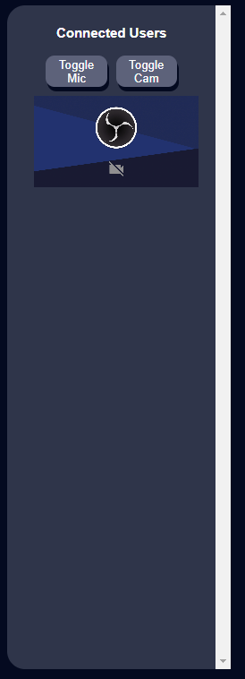
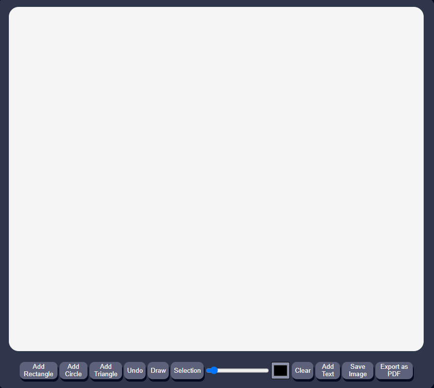
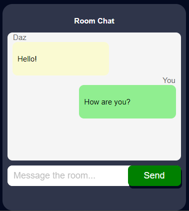

# Artistream Set Up Guide

Artistream has been designed to use minimal bandwidth during video conferencing, resulting in reduced network impact. This feature is especially beneficial for teleconferencing needs in countries with limited infrastructure, where network connectivity can be a significant concern.

## Installation

Use Node Package Manager (npm) to install the dependencies. From the project folder, in a terminal, write the following command to install the dependencies:

```bash
npm install
```

## Server Set Up

Use the below commands to launch the application.

If you are using Windows use the following:
```bash
npm run dev
```
If you are using MacOS or Ubuntu:
```bash
npm run devmac
```
This launches 3 processes - the Vite, Node.js and PeerJs servers.

Vite is used for the actual webpage development, Node.js is used for the socket.io server and PeerJs is used to connect different users to each other.

## Application Usage
### Connect Page
Once the servers have been set up you can now open your browser and navigate to the Artistream connect page. Currently Artistream can only be run on localhost so the location of the connect page will be on [localhost:5173/connect](localhost:5173/connect). If you wish to run Artistream from a different port then locate index.js in the Server folder and edit the port number on line 7. On the connect page you can do two things, make a room or join a room.



### Making or Joining a room
To make a room you must enter a username and leave the room ID blank, then click "Make Room". To join a room you must enter a username and enter the room ID, then click "Join Room". In both cases, you cannot leave the username blank.

### Call Page (A Room)
Within the call page/room you will be able to do the following: 
- A Room Code can be copied and shared. Simply click the "Copy room ID" button.

    

- Communicate with other users in the room via webcam and/or audio device.

    Currently available media controls: 
        
    1. Toggle Audio - toggles microphone access.
    2. Toggle Camera - toggles camera access.

    

- Draw on a shared canvas. Whatever is drawn on the canvas will be shared to all users within the room.

    Currently available canvas tools:

    1. Add Rectangle - adds a rectangle shape to the canvas.
    2. Add Circle - adds a circle shape to the canvas.
    3. Add Triangle - adds a triangle shape to the canvas.
    4. Undo - undo's the most recent canvas action.
    5. Draw - allows the user to draw on the canvas.
    6. Selection - a selector tool to select objects on the canvas.
    7. Brush Size Slider - adjusts the size of the brush strokes.
    8. Brush Colour Picker - allows user to change the colour of their brush strokes.
    9. Clear - removes everything from the canvas.
    10. Add Text - allows the user to add text to the canvas.
    11. Save Image - saves the canvas as a png file.
    12. Export as PDF - saves the canvas as a PDF file. 

    

- Chat with other users in the room.

    Write your message in the "Message the room" text input area then click the "Send" button once you are finished. 

    

## Testing Artistream
To test the project run the following command in the terminal from the project folder:
```bash
npm run test
```
In case of port (example, port 3000 and port 3001) conflicts run the following commands:
```bash
lsof -i :3000 # This command gives the Process ID (PID) of the port.
kill -9 (PID) # This command is used to kill the port using the respective Process ID (PID).
```